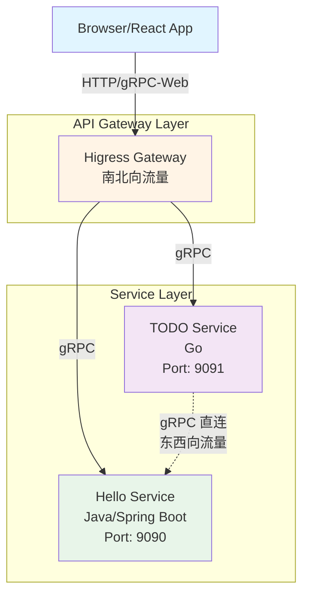

# Monorepo Hello/TODO Services

[](https://github.com)
[](docs/archive/LOCAL_SETUP_VERIFICATION.md)
[](LICENSE)

A multi-language monorepo project demonstrating microservices architecture with Java/Spring Boot, Go, and React/TypeScript.

## ✅ 项目状态

- **本地开发**: ✅ 已验证可运行 ([查看验证报告](docs/archive/LOCAL_SETUP_VERIFICATION.md))
- **构建系统**: ✅ 所有服务可成功构建
- **基础设施**: ✅ Envoy/Higress 配置完成
- **CI/CD**: ✅ 动态增量构建 ([查看策略](docs/ci-cd/DYNAMIC_CI_STRATEGY.md))
- **代码质量**: ✅ Shift-left 实践已实施 ([查看详情](docs/process/SHIFT_LEFT.md))
- **架构可扩展性**: ⭐⭐⭐⭐⭐ 支持无限服务扩展 ([查看分析](docs/archive/ARCHITECTURE_SCALABILITY_ANALYSIS.md))

## 项目概述

本项目是一个多语言 Monorepo，包含以下服务：

- **Hello Service** (Java/Spring Boot) - 提供问候功能的 gRPC 服务
- **TODO Service** (Go) - 提供任务管理功能的 gRPC 服务
- **Shortener Service** (Go) - 高性能 URL 短链接服务，支持自定义短码和多级缓存
- **Web Application** (React/TypeScript) - 前端单页应用

所有服务通过 Protobuf 定义统一的 API 契约，使用 gRPC 进行通信。

## 项目结构

```
.
├── api/                    # API 契约层 (Protobuf 定义)
│   └── v1/
│       ├── hello.proto
│       ├── todo.proto
│       └── shortener.proto
├── apps/                   # 应用服务
│   ├── hello-service/      # Java/Spring Boot 服务
│   ├── todo-service/       # Go 服务
│   ├── shortener-service/  # Go URL 短链接服务
│   └── web/                # React 前端应用
├── libs/                   # 共享库
├── tools/                  # 构建工具和配置
│   ├── envoy/              # Envoy 代理配置
│   ├── higress/            # Higress 网关配置
│   └── k8s/                # Kubernetes 资源
├── scripts/                # 构建和开发脚本
│   └── dev.sh              # 开发模式启动脚本
├── templates/              # 服务模板
│   ├── java-service/       # Java 服务模板
│   └── go-service/         # Go 服务模板
├── Makefile                # 统一构建命令
└── README.md
```

## 快速开始

> 📖 **详细指南**: 查看 [Getting Started Guide](docs/GETTING_STARTED.md) 获取完整的设置说明和故障排查。
> 
> ⚠️ **重要**: 
> - Protobuf 代码生成需要使用特定的工具版本。请参阅 [Protobuf 工具版本要求](docs/archive/PROTO_TOOLS_VERSION.md)。
> - 本项目采用混合的 Proto 生成策略（务实方案）。请参阅 [Proto Hybrid Strategy](docs/archive/PROTO_HYBRID_STRATEGY.md)。

### 🚀 一键初始化（推荐）

```bash
# 1. 克隆项目
git clone <repository-url>
cd cuckoo

# 2. 初始化环境（自动安装依赖和配置）
make init

# 3. 启动所有服务
./scripts/dev.sh

# 4. 访问前端
# 打开浏览器访问 http://localhost:5173
```

`make init` 会自动完成以下操作：
- ✅ 检查必需的工具（Java, Go, Node.js, protoc）
- ✅ 安装 Go 工具（protoc-gen-go, protoc-gen-go-grpc）
- ✅ 安装前端依赖（npm install）
- ✅ 生成 Protobuf 代码
- ✅ 安装 Git hooks
- ✅ 创建必要的目录

### 🔧 手动设置（如果需要）

如果 `make init` 失败或需要手动设置：

```bash
# 1. 安装依赖
# macOS
brew install protobuf go node

# 2. 安装 Go 工具（使用指定版本）
go install google.golang.org/protobuf/cmd/protoc-gen-go@v1.36.6
go install google.golang.org/grpc/cmd/protoc-gen-go-grpc@v1.5.1

# 3. 安装前端依赖
cd apps/web && npm install && cd ../..

# 4. 生成 Protobuf 代码
make proto

# 5. 安装 Git hooks
./scripts/install-hooks.sh
```

### 🎯 5 分钟快速验证

### 🎯 验证安装（可选）

初始化完成后，可以运行以下命令验证：

```bash
# 构建所有服务
make build

# 测试服务状态
./scripts/test-services.sh
```

### 前置要求

- **Java**: JDK 17+
- **Go**: Go 1.21+
- **Node.js**: Node 18+
- **Protocol Buffers**: protoc 3.x
- **Docker**: (可选) 用于容器化部署
- **Kubernetes**: (可选) 用于生产部署

### 安装依赖

**自动安装（推荐）**:
```bash
make init
```

**手动安装**:

```bash
# 安装 Protobuf 编译器 (macOS)
brew install protobuf

# 安装 Envoy (可选但推荐，用于 API 网关)
brew install envoy

# 安装 gRPC 插件
go install google.golang.org/protobuf/cmd/protoc-gen-go@latest
go install google.golang.org/grpc/cmd/protoc-gen-go-grpc@latest

# 安装前端依赖
cd apps/web && npm install && cd ../..
```

**关于 Envoy**:
- Envoy 是可选的，但强烈推荐安装
- 没有 Envoy，前端无法通过 API 网关访问后端服务
- 服务仍然可以独立运行和测试
- 安装命令：`brew install envoy` (macOS) 或参考 [Envoy 官方文档](https://www.envoyproxy.io/docs/envoy/latest/start/install)

### 生成代码

从 Protobuf 定义生成各语言的代码：

```bash
# 生成所有语言的代码
make proto

# 或者单独生成（高级用法）
make proto-go      # Go (alias for gen-proto-go)
make proto-java    # Java (alias for gen-proto-java)
make proto-ts      # TypeScript (alias for gen-proto-ts)

# 或使用完整命令名
make gen-proto-go      # Go
make gen-proto-java    # Java
make gen-proto-ts      # TypeScript
```

### 本地开发

#### 方式 1: 使用开发脚本（推荐）

```bash
# 启动所有服务
./scripts/dev.sh
```

这将同时启动：
- Hello Service (端口 9090)
- TODO Service (端口 9091)
- Web Application (端口 5173)
- Envoy Proxy (端口 8080)

#### 方式 2: 手动启动各服务

```bash
# 终端 1: 启动 Hello Service
cd apps/hello-service
./mvnw spring-boot:run

# 终端 2: 启动 TODO Service
cd apps/todo-service
go run .

# 终端 3: 启动 Web Application
cd apps/web
npm install
npm run dev
```

访问 http://localhost:5173 查看前端应用。

### 构建

```bash
# 构建所有服务
make build

# 构建特定应用（支持简写）
make build APP=hello            # 等同于 APP=hello-service
make build APP=todo             # 等同于 APP=todo-service
make build APP=web
```

> 💡 **提示**: 
> - 支持简写：`hello` → `hello-service`, `todo` → `todo-service`
> - 不指定 APP 参数时，系统会自动检测并构建变更的应用
> - 详见 [App Management Guide](docs/development/APP_MANAGEMENT.md)

### 测试

```bash
# 运行所有测试
make test

# 测试特定应用（支持简写）
make test APP=hello             # 等同于 APP=hello-service
make test APP=todo              # 等同于 APP=todo-service
make test APP=web
```

> 💡 **提示**: 新的 APP 参数方式支持自动检测变更的应用。详见 [App Management Guide](docs/development/APP_MANAGEMENT.md)

### 代码质量检查

```bash
# 运行所有预提交检查（推荐）
make pre-commit                 # 运行 lint、test、安全检查等

# 运行 lint 检查
make lint                       # 检查所有变更的应用
make lint APP=hello             # 检查特定应用（支持简写）

# 自动修复 lint 错误
make lint-fix                   # 修复所有变更的应用
make lint-fix APP=hello         # 修复特定应用（支持简写）

# 格式化代码
make format                     # 格式化所有变更的应用
make format APP=hello           # 格式化特定应用（支持简写）
```

**自动修复内容**:
- **Java**: Spotless 格式化（导入、空格、换行）
- **Go**: golangci-lint 可修复问题 + gofmt 格式化
- **Node.js**: ESLint 可修复问题

> 💡 **提示**: 详见 [Linting Guide](docs/development/LINTING_GUIDE.md) 和 [Code Quality Guide](docs/development/CODE_QUALITY.md)

### Docker 构建

```bash
# 构建所有 Docker 镜像
make docker-build

# 构建特定应用的镜像
make docker-build APP=hello-service
make docker-build APP=todo-service
```

> 💡 **提示**: 不指定 APP 参数时，系统会自动检测并构建变更应用的镜像。详见 [App Management Guide](docs/development/APP_MANAGEMENT.md)

## 架构说明

### 系统架构图



### 通信模式

- **南北向流量** (North-South): 前端 → Higress 网关 → 后端服务
  - 前端通过 Higress 网关访问所有后端服务
  - Higress 提供 gRPC-Web 到 gRPC 的协议转换
  - 统一的入口点，便于实施安全策略和监控

- **东西向流量** (East-West): 服务间直连 gRPC 通信
  - 服务间直接通过 gRPC 通信，避免网关成为瓶颈
  - 基于 K8s Service 进行服务发现
  - 使用共享 Protobuf 定义保证类型安全

详细的前后端通信架构说明请参考：
- **[apps/web/DEPLOYMENT.md](apps/web/DEPLOYMENT.md)** - 完整的部署和通信架构文档
- **[docs/process/COMMUNICATION.md](docs/process/COMMUNICATION.md)** - 快速参考指南

### API 契约

所有服务接口使用 Protobuf 定义在 `api/v1/` 目录：

- `hello.proto` - Hello 服务接口
- `todo.proto` - TODO 服务接口
- `shortener.proto` - URL 短链接服务接口

### 服务端口

- Hello Service: 9090 (gRPC)
- TODO Service: 9091 (gRPC)
- Shortener Service: 9092 (gRPC), 8080 (HTTP Redirect)
- Web Application: 5173 (开发模式)
- Envoy Proxy: 8080 (HTTP/gRPC-Web)

## 添加新服务

本项目提供了标准化的服务模板，帮助快速创建新服务。

### 使用 Create 命令（推荐）

最简单的方式是使用 `make create` 命令：

```bash
make create
```

这将交互式地提示您输入：
- 应用类型（java、go 或 node）
- 应用名称（例如：user-service）
- 端口号（如果不指定则自动分配）
- 描述
- 包名（Java 应用）
- 模块路径（Go 应用）
- 团队名称

或者直接使用脚本：

```bash
# 创建 Java 服务
./scripts/create-app.sh java user-service --port 9092 --description "用户管理服务"

# 创建 Go 服务
./scripts/create-app.sh go payment-service --port 9093

# 创建 Node.js 应用
./scripts/create-app.sh node admin-dashboard
```

创建后，您的新应用将自动集成：
- ✅ 应用管理系统（make test/build/lint 等）
- ✅ 变更自动检测
- ✅ CI/CD 流水线
- ✅ 测试框架和覆盖率要求
- ✅ Docker 构建支持
- ✅ Kubernetes 部署模板

详细说明请参考 [应用管理指南](docs/APP_MANAGEMENT.md#adding-new-apps)

### 手动使用模板

如果您更喜欢手动创建：

#### 使用 Java 模板

```bash
# 1. 复制模板
cp -r templates/java-service apps/my-new-service
cd apps/my-new-service

# 2. 替换占位符
# 在所有文件中替换以下占位符：
# - {{SERVICE_NAME}} → 你的服务名称 (例如: user-service)
# - {{SERVICE_DESCRIPTION}} → 服务描述
# - {{GRPC_PORT}} → gRPC 端口号 (例如: 9092)
# - {{PACKAGE_NAME}} → Java 包名 (例如: com.myorg.user)
# - {{PROTO_FILE}} → Protobuf 文件名 (例如: user.proto)
# - {{TEAM_NAME}} → 团队名称 (例如: backend-team)

# 3. 定义 Protobuf API
# 在 api/v1/ 创建你的 .proto 文件

# 4. 生成代码
make proto

# 5. 实现服务逻辑
# 编辑 src/main/java/.../service/YourServiceImpl.java

# 6. 构建和测试
./gradlew build
./gradlew test
```

详细说明请参考 [templates/java-service/README.md](templates/java-service/README.md)

### 使用 Go 模板

```bash
# 1. 复制模板
cp -r templates/go-service apps/my-new-service
cd apps/my-new-service

# 2. 替换占位符
# 在所有文件中替换以下占位符：
# - {{SERVICE_NAME}} → 你的服务名称 (例如: user-service)
# - {{SERVICE_DESCRIPTION}} → 服务描述
# - {{GRPC_PORT}} → gRPC 端口号 (例如: 9092)
# - {{MODULE_PATH}} → Go 模块路径 (例如: github.com/myorg/myrepo/apps/user-service)
# - {{PROTO_FILE}} → Protobuf 文件名 (例如: user.proto)
# - {{PROTO_PACKAGE}} → Protobuf 包名 (例如: userpb)
# - {{TEAM_NAME}} → 团队名称 (例如: backend-team)

# 3. 定义 Protobuf API
# 在 api/v1/ 创建你的 .proto 文件

# 4. 生成代码
make proto

# 5. 实现服务逻辑
# 编辑 service/your_service.go 和 storage/memory_store.go

# 6. 构建和测试
go build .
go test ./...
```

详细说明请参考 [templates/go-service/README.md](templates/go-service/README.md)

### 添加新 API

1. 在 `api/v1/` 目录创建新的 `.proto` 文件
2. 定义服务接口和消息类型
3. 运行 `make proto` 生成代码
4. 在服务中实现接口
5. 更新 Kubernetes 配置和 Backstage catalog

### 集成到构建系统

在根目录 `Makefile` 中添加新服务的构建目标：

```makefile
build-my-new-service:
	@echo "Building my-new-service..."
	cd apps/my-new-service && ./gradlew build  # Java
	# 或
	cd apps/my-new-service && go build .       # Go

test-my-new-service:
	@echo "Testing my-new-service..."
	cd apps/my-new-service && ./gradlew test   # Java
	# 或
	cd apps/my-new-service && go test ./...    # Go
```

## 部署

### 本地开发 (Docker Compose)

使用 Docker Compose 在本地运行所有服务：

```bash
# 启动所有服务（基础设施 + 应用）
make dev-up

# 仅启动基础设施（MySQL, Redis, etcd, Kafka）
make infra-up

# 仅启动应用服务
make services-up

# 重启应用服务（保持基础设施运行）
make dev-restart

# 停止所有服务
make dev-down
```

**优势**:
- 快速启动和停止
- 与生产环境架构一致
- 支持独立启动基础设施和服务
- 适合日常开发和调试

详细说明请参考 [Docker 部署指南](deploy/docker/README.md)

### Kubernetes 部署

#### 验证配置

```bash
# 验证 Kubernetes 配置
make k8s-validate
```

#### 部署基础设施

使用 Helm 部署基础设施组件（MySQL, Redis, Kafka）：

```bash
# 部署所有基础设施
make k8s-infra-deploy

# 或手动部署单个组件
helm install mysql bitnami/mysql -f deploy/k8s/infra/mysql-values.yaml
helm install redis bitnami/redis -f deploy/k8s/infra/redis-values.yaml
helm install kafka bitnami/kafka -f deploy/k8s/infra/kafka-values.yaml
kubectl apply -k deploy/k8s/infra/etcd/
```

#### 部署应用服务

使用 Kustomize 部署应用服务：

```bash
# 部署到开发环境
make k8s-deploy-dev

# 部署到生产环境
make k8s-deploy-prod

# 或使用 kubectl
kubectl apply -k deploy/k8s/overlays/development
kubectl apply -k deploy/k8s/overlays/production
```

#### 验证部署

```bash
# 查看 Pod 状态
kubectl get pods -n production

# 查看服务
kubectl get svc -n production

# 查看 Ingress
kubectl get ingress -n production

# 查看日志
kubectl logs -f deployment/hello-service -n production
```

**环境说明**:
- **Development**: 1 副本，最小资源，调试日志
- **Production**: 3+ 副本，生产资源，HPA 自动扩缩容

详细说明请参考：
- [Kubernetes 部署指南](deploy/k8s/README.md)
- [完整部署指南](docs/deployment/DEPLOYMENT_GUIDE.md)
- [部署快速参考](docs/deployment/DEPLOYMENT_QUICK_REFERENCE.md)

### 配置说明

#### Docker Compose
- **基础设施**: `deploy/docker/docker-compose.infra.yml`
- **应用服务**: `deploy/docker/docker-compose.services.yml`
- **使用方式**: 使用 `make dev-up` 或直接使用两个文件

#### Kubernetes
- **基础设施**: `deploy/k8s/infra/` (Helm charts)
- **应用服务**: `deploy/k8s/services/` (Kustomize)
- **环境配置**: `deploy/k8s/overlays/` (development, production)

## CI/CD

项目使用 GitHub Actions 进行持续集成：

- 代码提交时自动运行测试
- 验证 Protobuf 生成代码是否最新
- 构建 Docker 镜像并推送到镜像仓库
- 自动部署到 Kubernetes 集群

## 代码所有权

代码所有权定义在 `.github/CODEOWNERS` 文件中：

- **API 契约层** (`/api/`): @platform-team
- **前端应用** (`/apps/web/`): @frontend-team
- **Java 服务** (`/apps/hello-service/`): @backend-java-team
- **Go 服务** (`/apps/todo-service/`): @backend-go-team
- **基础设施** (`/tools/`, `/k8s/`, `/scripts/`): @platform-team
- **文档** (`/docs/`, `README.md`): @platform-team

### Pull Request 审批要求

- 所有 PR 必须通过 CI 检查
- 需要至少一个 CODEOWNERS 成员审批
- API 变更需要 @platform-team 审批
- 跨服务变更需要相关团队共同审批

详细的治理流程请参考 [docs/process/governance.md](docs/process/governance.md)

## 开发规范

### 提交前检查

项目配置了 pre-commit hook，会自动检查：

- ✅ 工具版本是否正确
- ✅ Protobuf 生成代码是否最新
- ✅ 代码格式是否符合规范
- ✅ 单元测试是否通过
- ✅ 是否包含潜在的安全问题

手动运行所有检查：

```bash
make pre-commit
```

详细的 Shift-Left 实践请参考 [docs/process/SHIFT_LEFT.md](docs/process/SHIFT_LEFT.md)

### Pull Request 流程

1. 创建功能分支
2. 提交代码并推送
3. 创建 Pull Request
4. 等待 CI 通过和代码审查
5. 合并到主分支

## 故障排查

### Protobuf 生成失败

```bash
# 确保 protoc 已安装
protoc --version

# 确保插件已安装
which protoc-gen-go
which protoc-gen-go-grpc
```

### 服务启动失败

```bash
# 检查端口是否被占用
lsof -i :9090
lsof -i :9091

# 查看服务日志
cd apps/hello-service && ./mvnw spring-boot:run
cd apps/todo-service && go run .
```

### 前端无法连接后端

确保 Envoy 代理正在运行，或者在 `vite.config.ts` 中配置了正确的代理设置。

## 更多信息

### 📚 文档中心

**完整文档索引**: [docs/README.md](docs/README.md) - 所有文档的导航中心

### 🚀 快速入门文档

- [快速开始](docs/GETTING_STARTED.md) - 详细的环境设置指南
- [快速参考](docs/QUICK_REFERENCE.md) - 常用命令速查

### 🏗️ 架构文档

- [系统架构](docs/architecture/ARCHITECTURE.md) - 系统架构和设计决策
- [基础设施](docs/architecture/INFRASTRUCTURE.md) - K8s 和 Higress 配置
- [Higress 路由配置](docs/architecture/HIGRESS_ROUTING_CONFIGURATION.md) - API 网关路由

### 💻 开发文档

- [代码质量](docs/development/CODE_QUALITY.md) - 代码质量工具和规范
- [测试指南](docs/development/TESTING_GUIDE.md) - 测试编写、运行和覆盖率要求
- [代码检查指南](docs/development/LINTING_GUIDE.md) - Linting 配置和使用说明
- [创建应用](docs/development/CREATE_APP_GUIDE.md) - 创建新应用的完整指南
- [应用管理](docs/development/APP_MANAGEMENT.md) - 应用管理系统使用指南
- [Makefile 指南](docs/development/MAKEFILE_GUIDE.md) - Makefile 使用和 Proto 生成

### 🚢 部署文档

- [部署指南](docs/deployment/DEPLOYMENT_GUIDE.md) - 所有环境的完整部署指南
- [部署快速参考](docs/deployment/DEPLOYMENT_QUICK_REFERENCE.md) - 部署命令速查
- [生产运维](docs/deployment/PRODUCTION_OPERATIONS.md) - 生产环境运维指南
- [Docker 部署](deploy/docker/README.md) - Docker Compose 本地开发
- [Kubernetes 部署](deploy/k8s/README.md) - Kubernetes 生产部署

### 🔄 CI/CD 文档

- [动态 CI 策略](docs/ci-cd/DYNAMIC_CI_STRATEGY.md) - CI/CD 流水线设计
- [集成测试](docs/ci-cd/INTEGRATION_TESTS_IMPLEMENTATION.md) - 集成测试实现
- [覆盖率快速参考](docs/ci-cd/COVERAGE_QUICK_REFERENCE.md) - 代码覆盖率指南

### 📋 流程与治理

- [治理文档](docs/process/governance.md) - 代码所有权和 PR 流程
- [通信指南](docs/process/COMMUNICATION.md) - 前后端通信模式
- [Shift-Left 实践](docs/process/SHIFT_LEFT.md) - 质量左移和预提交检查

### 📦 服务模板

- [Java 服务模板](templates/java-service/README.md) - 创建新的 Java/Spring Boot 服务
- [Go 服务模板](templates/go-service/README.md) - 创建新的 Go 服务

### 🔧 服务文档

- [Hello Service](apps/hello-service/README.md) - Java/Spring Boot 问候服务
- [TODO Service](apps/todo-service/README.md) - Go 任务管理服务
- [Shortener Service](apps/shortener-service/README.md) - Go URL 短链接服务
- [Web Application](apps/web/README.md) - React 前端应用

### 📖 API 文档

- [API 文档](api/v1/README.md) - Protobuf API 定义和使用说明

### 📜 历史文档

- [文档归档](docs/archive/README.md) - 历史文档和迁移记录

## 贡献指南

欢迎贡献！请遵循以下步骤：

1. Fork 本仓库
2. 创建功能分支 (`git checkout -b feature/amazing-feature`)
3. 提交更改 (`git commit -m 'Add amazing feature'`)
4. 推送到分支 (`git push origin feature/amazing-feature`)
5. 创建 Pull Request

请确保：
- 所有测试通过
- 代码符合格式规范
- 更新相关文档
- 遵循代码所有权规则

## 许可证

[MIT License](LICENSE)
