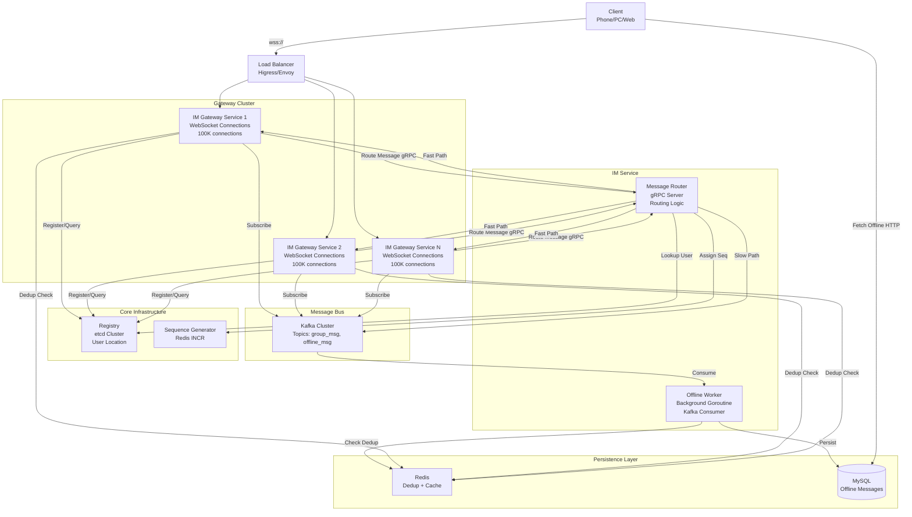
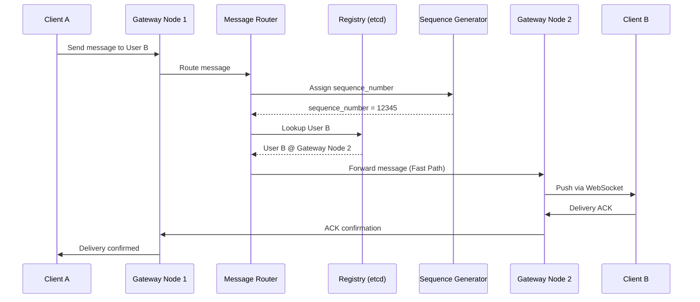
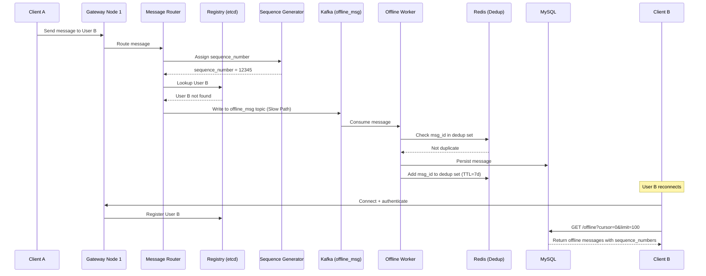
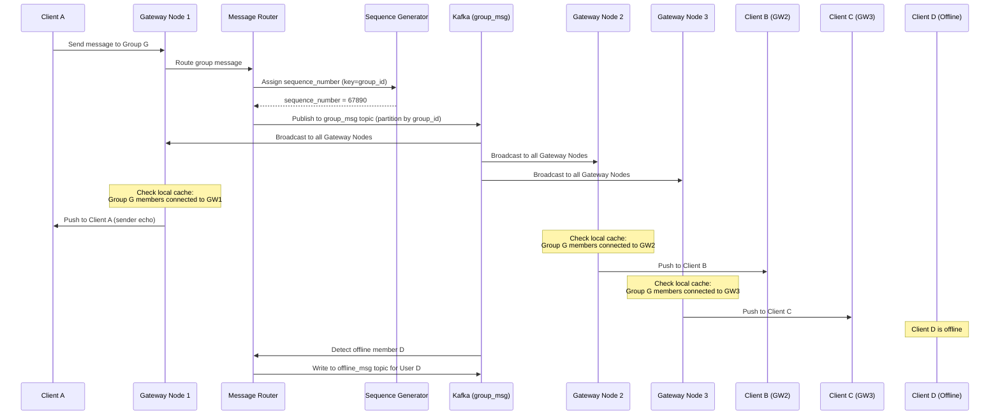
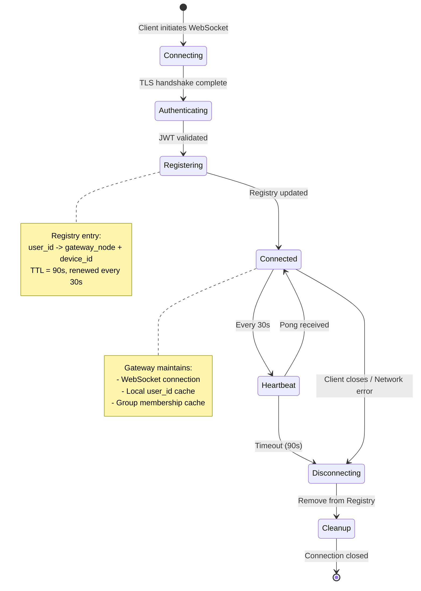

# IM Chat System 架构设计

## 概述

IM Chat System 是一个水平可扩展的即时通讯平台，设计支持 1000 万+ 并发用户。架构采用**状态同步模型**，具有两条不同的消息传递路径：

- **快速路径 (Fast Path)**: 通过 WebSocket 实时传递给在线用户 (P99 < 200ms)
- **慢速路径 (Slow Path)**: 通过持久化队列异步传递给离线用户

### 核心设计原则

1. **无状态网关节点**: 所有连接状态存储在分布式 Registry (etcd) 中，支持无缝水平扩展
2. **双路径路由**: Message Router 根据 Registry 查询结果动态选择 Fast Path 或 Slow Path
3. **至少一次投递**: 通过多层去重（服务端 Redis + 客户端 SQLite）保证消息投递
4. **最终一致性**: 群组成员缓存使用 TTL + Watch 机制进行失效处理
5. **关注点分离**: 连接管理、路由、持久化和投递之间有清晰的边界

## 系统架构

### 高层架构图

## 服务架构

### 1. IM Gateway Service (im-gateway-service)

**职责**: 管理 WebSocket 连接和实时消息投递

**主要功能**:
- 接受和维护客户端 WebSocket 连接 (100K+/节点)
- 通过 Auth Service 处理客户端认证
- 在 Registry (etcd) 中注册/注销用户
- 发送心跳 ping 并监控连接健康状态
- 通过 WebSocket 推送消息给已连接客户端
- 收集投递确认 (ACK)
- 本地缓存用户和群组成员数据
- 从 Kafka 消费群组消息进行广播

**端口**: 9093 (gRPC 内部通信) + 8082 (WebSocket 客户端)

### 2. IM Service (im-service)

**职责**: 核心消息路由和离线消息持久化

**主要功能**:
- 路由私聊和群聊消息
- 通过 Sequence Generator 分配序列号
- 查询 Registry 确定在线/离线状态
- 路由到 Fast Path (在线用户) 或 Slow Path (离线用户)
- 应用敏感词过滤
- 处理消息加密
- 管理投递重试和降级逻辑
- **运行 Kafka 消费者持久化离线消息** (服务启动时自动激活)

**端口**: 9094 (gRPC)

## 消息流程

### 私聊消息流程 (在线用户)

### 私聊消息流程 (离线用户)

### 群聊消息流程

### 连接生命周期

## 技术栈

| 组件 | 技术选型 | 说明 |
|------|----------|------|
| Gateway | Go | goroutines 支持 C100K+ 连接，8KB/连接内存占用 |
| Registry | etcd (3-5 节点) | Watch API 用于缓存失效 |
| Message Bus | Kafka | 群组消息广播、离线队列，复制因子 3 |
| Cache | Redis | 去重集合、序列号生成 |
| Database | MySQL | 离线消息持久化，7 天保留期 |
| Protocol | WebSocket (wss:// TLS 1.3) | 客户端连接 |
| Internal | gRPC + Protobuf | 服务间通信 |
| Deployment | Kubernetes + Higress | 容器编排和网关 |
| Monitoring | Prometheus + Grafana | 可观测性 |

## 相关文档

- 详细设计: `.kiro/specs/im-chat-system/design.md`
- 架构决策记录: `.kiro/specs/im-chat-system/ARCHITECTURE_DECISIONS.md`
- API 定义: `api/v1/im.proto`, `api/v1/im-gateway.proto`
