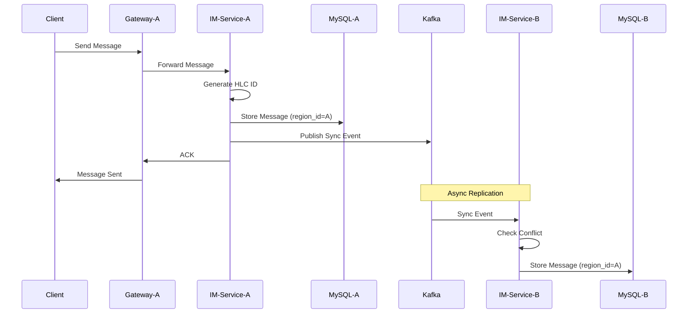
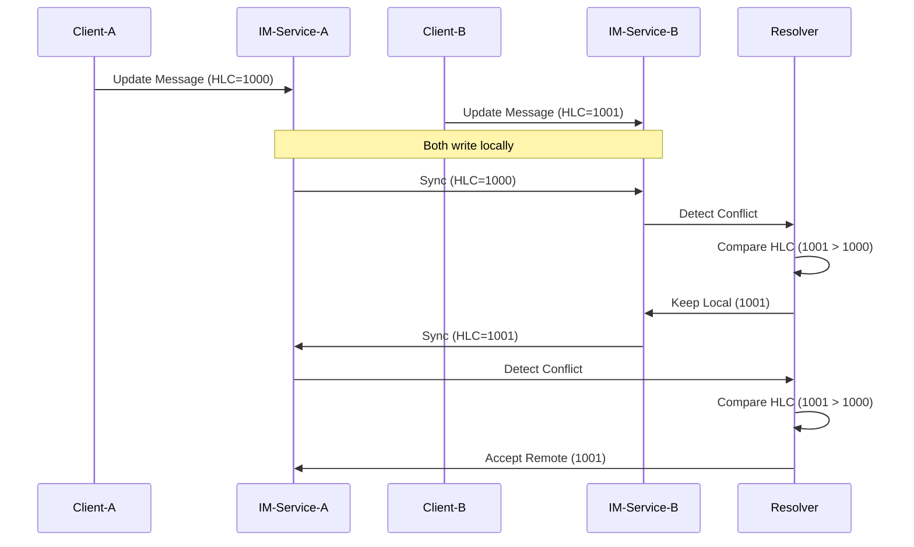
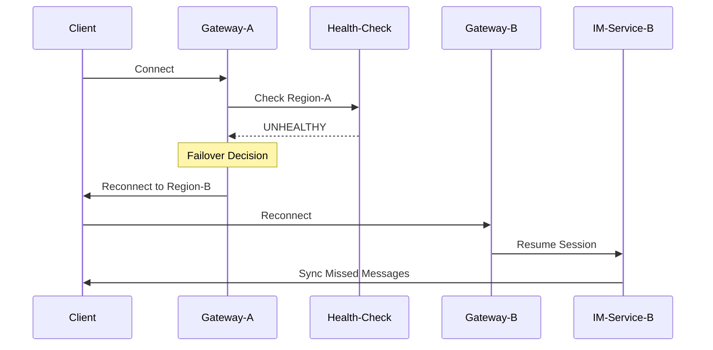

# Multi-Region Active-Active Architecture Overview

## 🏗️ System Architecture

### High-Level Architecture

```
┌─────────────────────────────────────────────────────────────────────────────┐
│                        Global DNS + Health Checks                           │
│                      (Route53 / Cloud DNS / GeoDNS)                         │
└─────────────────────┬───────────────────────┬───────────────────────────────┘
                      │                       │
              ┌───────▼────────┐      ┌───────▼────────┐
              │   Region-A     │      │   Region-B     │
              │   (Primary)    │◄────►│   (Secondary)  │
              │   Beijing      │      │   Shanghai     │
              └────────────────┘      └────────────────┘
                      │                       │
    ┌─────────────────┼─────────────────┐    │
    │                 │                 │    │
┌───▼───┐    ┌────▼────┐    ┌────▼────┐ │    │
│ IM    │    │ IM      │    │ Auth/   │ │    │
│Gateway│    │Service  │    │User Svc │ │    │
│       │    │         │    │         │ │    │
└───┬───┘    └────┬────┘    └────┬────┘ │    │
    │             │              │      │    │
┌───▼───┐    ┌────▼────┐    ┌────▼────┐ │    │
│ Redis │    │ MySQL   │    │ Kafka   │ │    │
│ Cache │    │ Primary │    │ Broker  │ │    │
└───┬───┘    └────┬────┘    └────┬────┘ │    │
    │             │              │      │    │
    └─────────────┴──────────────┴──────┘    │
                  │                           │
    ┌─────────────┼───────────────────────────┼─────────────┐
    │             │         etcd Cluster      │             │
    │             │    (Service Discovery &   │             │
    │             │     Distributed Locks)    │             │
    └─────────────┴───────────────────────────┴─────────────┘
                  │                           │
                  └───────────────────────────┘
                    Cross-Region Replication
```

## 🔑 Key Components

### 1. IM Gateway Service
**Purpose**: Entry point for client connections, geo-routing

**Key Features**:
- WebSocket connection management
- Health-aware geo-routing
- Automatic failover on region failure
- Connection state tracking

**Technology**:
- Go + Gorilla WebSocket
- Health check integration
- Metrics collection (Prometheus)

**Code Location**: `apps/im-gateway-service/`

### 2. IM Service
**Purpose**: Core message processing and storage

**Key Features**:
- HLC-based global ID generation
- Cross-region message synchronization
- Conflict detection and resolution
- Offline message management

**Technology**:
- Go + gRPC
- MySQL for persistence
- Redis for caching
- Kafka for async messaging

**Code Location**: `apps/im-service/`

### 3. HLC (Hybrid Logical Clock)
**Purpose**: Generate globally unique, causally-ordered IDs

**Key Features**:
- Physical + logical timestamp
- No cross-region coordination needed
- Tolerates clock skew
- Preserves causality

**Algorithm**:
```
HLC = max(physical_clock, last_hlc) + logical_counter
GlobalID = {region_id}-{hlc_timestamp}-{logical_counter}-{sequence}
```

**Code Location**: `libs/hlc/`

### 4. Conflict Resolver
**Purpose**: Resolve concurrent writes across regions

**Strategy**: Last Write Wins (LWW) with RegionID Tiebreaker

**Resolution Logic**:
```
1. Compare HLC timestamps
2. If equal, compare RegionID (deterministic)
3. Winner's data is kept
4. Log conflict for monitoring
```

**Code Location**: `sync/conflict_resolver.go`

### 5. Geo Router
**Purpose**: Route traffic to healthy regions

**Routing Logic**:
```
1. Check local region health
2. If healthy, route locally
3. If unhealthy, route to remote region
4. Update metrics
```

**Code Location**: `routing/geo_router.go`

## 📊 Data Flow

### Normal Operation: Message Send



### Conflict Resolution: Concurrent Writes



### Failover: Region Failure



## 🔄 Cross-Region Synchronization

### Synchronization Layers

| Layer | Technology | Sync Method | Latency | RPO |
|-------|-----------|-------------|---------|-----|
| **Cache** | Redis | Active-Active Replication | <100ms | ~0 |
| **Messages** | Kafka | MirrorMaker 2 | <500ms | <1s |
| **Database** | MySQL | Async Replication | <1s | <1s |
| **Coordination** | etcd | Raft Consensus | <200ms | 0 |

### Synchronization Guarantees

1. **Eventual Consistency**: All regions converge to same state
2. **Causal Ordering**: HLC preserves message causality
3. **Conflict Resolution**: Deterministic LWW strategy
4. **No Data Loss**: WAL + replication for durability

## 🛡️ Fault Tolerance

### Failure Scenarios

| Scenario | Detection | Recovery | RTO | RPO |
|----------|-----------|----------|-----|-----|
| **Service Crash** | Health Check | Auto Restart | <10s | 0 |
| **Region Failure** | Multi-Check | Auto Failover | <30s | <1s |
| **Network Partition** | Timeout | Arbitration | <30s | <1s |
| **Database Failure** | Connection Error | Replica Promotion | <60s | <1s |

### Split-Brain Prevention

**Arbitration Strategy**:
1. **External Observer**: Cloud DNS health checks
2. **Distributed Lock**: etcd-based leader election
3. **Quorum**: Majority region wins
4. **Read-Only Mode**: Minority region degrades gracefully

## 📈 Scalability

### Horizontal Scaling

```
Region-A:
  IM-Gateway: 3 instances (load balanced)
  IM-Service: 5 instances (stateless)
  MySQL: 1 primary + 2 replicas
  Redis: 3-node cluster
  Kafka: 3 brokers

Region-B:
  (Same configuration)
```

### Capacity Planning

| Metric | Current | Target | Scaling Strategy |
|--------|---------|--------|------------------|
| **Concurrent Users** | 100K | 500K | Add IM-Service instances |
| **Messages/sec** | 10K | 50K | Scale Kafka partitions |
| **Storage** | 1TB | 10TB | Add MySQL replicas |
| **Network** | 100Mbps | 1Gbps | Upgrade links |

## 🔍 Observability

### Key Metrics

**Performance Metrics**:
- `cross_region_sync_latency_ms` - P50/P95/P99 sync latency
- `message_processing_duration_ms` - Message processing time
- `failover_duration_ms` - Failover completion time

**Reliability Metrics**:
- `cross_region_conflicts_total` - Conflict rate
- `failover_events_total` - Failover frequency
- `message_sync_errors_total` - Sync failure rate

**Business Metrics**:
- `active_connections` - Current WebSocket connections
- `messages_sent_total` - Total messages sent
- `offline_messages_pending` - Pending offline messages

### Monitoring Stack

```
┌─────────────┐
│  Services   │
└──────┬──────┘
       │ metrics
       ▼
┌─────────────┐
│ Prometheus  │ ◄─── Scrape metrics
└──────┬──────┘
       │ query
       ▼
┌─────────────┐
│  Grafana    │ ◄─── Visualize
└─────────────┘
       │ alerts
       ▼
┌─────────────┐
│ AlertManager│ ◄─── Notify
└─────────────┘
```

## 🎯 Design Principles

### 1. Simplicity
- Extend existing services, don't create new ones
- Use proven technologies (MySQL, Redis, Kafka)
- Minimize moving parts

### 2. Reliability
- No single point of failure
- Automatic failover
- Data replication and backups

### 3. Performance
- Local reads, async writes
- Caching at multiple layers
- Efficient serialization (Protocol Buffers)

### 4. Observability
- Comprehensive metrics
- Distributed tracing
- Structured logging

### 5. Operability
- Simple deployment (Docker Compose)
- Clear documentation
- Automated testing

## 🚀 Deployment Architecture

### Production Deployment

```
┌─────────────────────────────────────────────────────────────┐
│                     Cloud Provider (AWS/Aliyun)             │
├─────────────────────────────────────────────────────────────┤
│                                                             │
│  Region: Beijing (cn-north-1)                              │
│  ┌─────────────────────────────────────────────────────┐   │
│  │ VPC: 10.0.0.0/16                                    │   │
│  │ ┌─────────────┐  ┌─────────────┐  ┌─────────────┐  │   │
│  │ │ EKS Cluster │  │ RDS MySQL   │  │ ElastiCache │  │   │
│  │ │ (K8s)       │  │ (Primary)   │  │ (Redis)     │  │   │
│  │ └─────────────┘  └─────────────┘  └─────────────┘  │   │
│  └─────────────────────────────────────────────────────┘   │
│                                                             │
│  Region: Shanghai (cn-east-1)                              │
│  ┌─────────────────────────────────────────────────────┐   │
│  │ VPC: 10.1.0.0/16                                    │   │
│  │ ┌─────────────┐  ┌─────────────┐  ┌─────────────┐  │   │
│  │ │ EKS Cluster │  │ RDS MySQL   │  │ ElastiCache │  │   │
│  │ │ (K8s)       │  │ (Replica)   │  │ (Redis)     │  │   │
│  │ └─────────────┘  └─────────────┘  └─────────────┘  │   │
│  └─────────────────────────────────────────────────────┘   │
│                                                             │
│  Cross-Region:                                             │
│  - VPC Peering (10.0.0.0/16 ↔ 10.1.0.0/16)               │
│  - Direct Connect (Dedicated 1Gbps)                       │
│  - Route53 Health Checks                                  │
└─────────────────────────────────────────────────────────────┘
```

## 📚 Further Reading

- [Design Document](../../.kiro/specs/multi-region-active-active/design.md)
- [Architecture Decision Records](../../.kiro/specs/multi-region-active-active/adr/)
- [Implementation Guide](../../apps/MULTI_REGION_INTEGRATION_COMPLETE.md)
- [HLC Implementation](./blog-hlc-implementation.md)
- [Conflict Resolution Strategy](./blog-conflict-resolution.md)

---

**Next**: [Data Flow Diagrams](./data-flow-diagrams.md) | [Failover Sequence](./failover-sequence.md)
